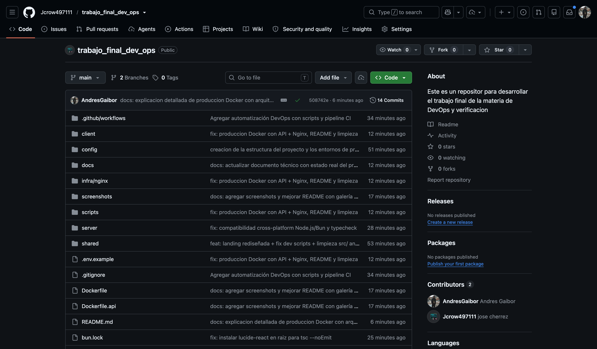
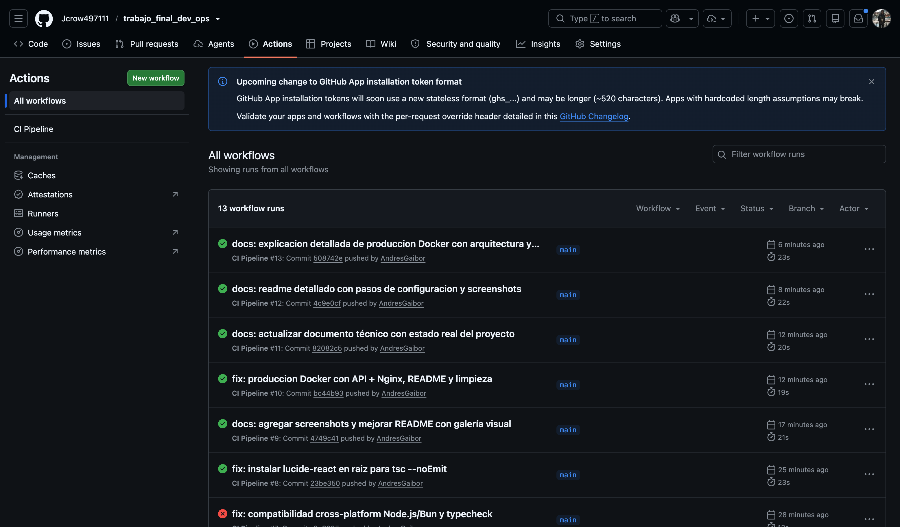
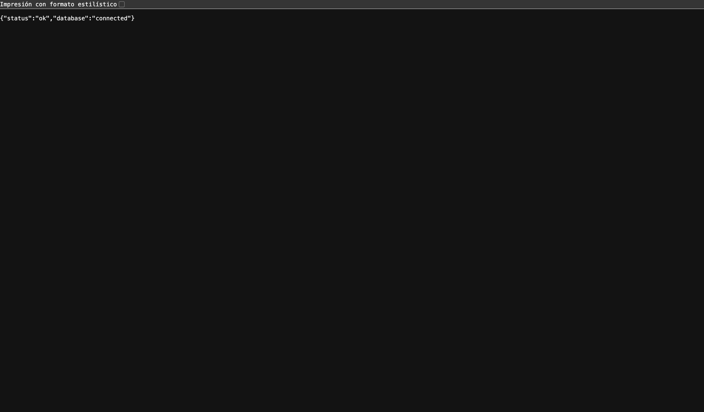

# TaskFlow — Gestión de Tareas

Aplicación web full-stack de gestión de tareas construida con **React + Hono + Turso**.

## Capturas de Pantalla

| Landing | Dashboard |
|---------|-----------|
|  |  |

| Tareas | Kanban |
|--------|--------|
|  |  |

| Estadísticas | Login | Registro |
|-------------|-------|----------|
|  |  |  |

### Infraestructura y CI/CD

| GitHub — Repositorio | GitHub — Actions CI |
|----------------------|---------------------|
|  |  |

| Backend — Health Check |
|------------------------|
|  |

## Tecnologías

| Tecnología | Propósito |
|------------|-----------|
| React 18 | Interfaz de usuario |
| TypeScript | Tipado estático |
| Vite | Build y dev server |
| Bun / Node.js | Runtime (compatible con ambos) |
| Hono | Backend API REST |
| Turso (libSQL) | Base de datos SQLite distribuida |
| Drizzle ORM | ORM tipado |
| Tailwind CSS | Estilos |
| Docker + Nginx | Contenedor multi-etapa + proxy reverso |
| GitHub Actions | Integración continua |

## Requisitos

- [Bun](https://bun.sh) (recomendado) o Node.js 18+
- Docker Desktop (para producción)

## Primeros Pasos

### 1. Clonar e Instalar

```bash
git clone https://github.com/Jcrow497111/trabajo_final_dev_ops.git
cd trabajo_final_dev_ops
bun install
```

> También funciona con `npm install`.

### 2. Configurar Variables de Entorno

El servidor necesita credenciales de Turso. Crea un archivo `.env` en la raíz:

```bash
TURSO_DATABASE_URL=libsql://<tu-database>.turso.io
TURSO_AUTH_TOKEN=eyJ...
```

El cliente en desarrollo necesita `client/.env`:

```bash
VITE_API_URL=http://localhost:3000
```

Y para build de producción `client/.env.production`:

```bash
VITE_API_URL=/api
```

> **Resumen:** El servidor lee `.env` (raíz). Vite lee `client/.env` (dev) o `client/.env.production` (build).

### 3. Migraciones

```bash
bun run db:migrate
```

### 4. Iniciar en Desarrollo

```bash
bun run dev
# o
npm run dev
```

| Servicio | URL |
|----------|-----|
| Frontend | http://localhost:5173 |
| Backend | http://localhost:3000/api/health |

## Scripts de Automatización DevOps

| Script | Descripción |
|--------|-------------|
| `./scripts/install.sh` | Verifica Bun instalado e instala dependencias |
| `./scripts/run.sh` | Inicia frontend + backend en desarrollo |
| `./scripts/test.sh` | Ejecuta la suite de pruebas |
| `./scripts/build.sh` | Build de producción con Vite |
| `./scripts/validate.sh` | Validación completa: typecheck → test → build |
| `./scripts/deploy-local.sh` | Despliegue local con Docker Compose |
| `./scripts/check.sh` | Verifica que los ambientes dev/test/prod respondan |
| `./scripts/stop.sh` | Detiene todos los servicios |
| `./scripts/run-env.sh` | Levanta entorno específico (dev\|test\|prod) en Docker |

## Validación

```bash
./scripts/validate.sh    # typecheck + tests + build
```

## Flujo DevOps

```
                       ┌───────────────────────┐
                       │   GitHub Push / PR     │
                       └──────────┬────────────┘
                                  ▼
                   ┌─────────────────────────────┐
                   │   GitHub Actions (CI)        │
                   │   .github/workflows/ci.yml   │
                   │                              │
                   │   1. bun install             │
                   │   2. bun run typecheck       │
                   │   3. bun run test (27 tests) │
                   │   4. bun run build           │
                   │   5. Verificar client/dist/  │
                   └─────────────────────────────┘
                                  │
                    ┌─────────────┴─────────────┐
                    ▼                           ▼
          ┌──────────────────┐      ┌──────────────────────┐
          │  ./scripts/      │      │  Docker Producción    │
          │  Automatización  │      │                      │
          │  local           │      │  docker compose up    │
          │                  │      │  Nginx → Hono → Turso│
          │  install.sh      │      └──────────────────────┘
          │  validate.sh     │
          │  build.sh        │
          │  deploy-local.sh │
          └──────────────────┘
```

### Flujo de trabajo recomendado

1. **Desarrollo local:** `./scripts/run.sh` o `bun run dev`
2. **Validar cambios:** `./scripts/validate.sh` (typecheck + tests + build)
3. **Commit y push:** El CI pipeline verifica automáticamente
4. **Despliegue producción:** `./scripts/deploy-local.sh` o `docker compose up --build`

### Resultados de pruebas

```bash
$ bun run test

 ✓ client/src/tests/task-validation.test.tsx (13 tests)
 ✓ client/src/tests/task-crud.test.tsx (14 tests)

 Test Files  2 passed (2)
      Tests  27 passed (27)
```

Los tests cubren:
- **TaskTable** (7 tests): renderizado, badges de estado, acciones Ver/Eliminar
- **TaskForm** (5 tests): validación de campos, envío con datos válidos, edición
- **TaskFilters** (2 tests): búsqueda y filtro por estado
- **Schemas compartidos** (13 tests): validación Zod de tipos de datos

## Producción (Docker)

La aplicación se despliega con dos contenedores coordinados por `docker-compose.yml`.

### Arquitectura

```
                        docker-compose.yml
┌──────────────────────────────────────────────────────┐
│                                                      │
│  Host:8080                                           │
│      │                                               │
│      ▼                                               │
│  ┌──────────────────────┐     ┌──────────────────┐   │
│  │   web (Nginx)        │     │  api (Bun+Hono)   │   │
│  │                      │     │                   │   │
│  │  / → index.html     │     │  :3000            │   │
│  │  /assets/* → estático│     │  GET /api/health │   │
│  │  /api/* ──proxy──→ │     │  POST /api/auth/* │   │
│  │                      │     │  GET/POST /api/tasks│ │
│  └──────────────────────┘     │  DELETE /api/tasks│ │
│                               └──────────────────┘   │
│                                        │              │
│                                        ▼              │
│                               Turso (libSQL cloud)     │
│                               "devops-andresgaibor    │
│                                .turso.io"             │
└──────────────────────────────────────────────────────┘
```

### Los archivos

**`Dockerfile`** — Build multi-etapa del frontend:

```dockerfile
FROM oven/bun:1 AS build         # 1. Imagen con Bun
WORKDIR /app
COPY package.json bun.lock ./    # 2. Solo dependencias primero (cache)
RUN bun install --frozen-lockfile
COPY . .                         # 3. Código fuente
RUN bun run build                # 4. Compila React → client/dist/

FROM nginx:alpine                # 5. Imagen final mínima
COPY --from=build /app/client/dist /usr/share/nginx/html
COPY infra/nginx/default.conf /etc/nginx/conf.d/default.conf
EXPOSE 80
```

**`Dockerfile.api`** — Build del backend:

```dockerfile
FROM oven/bun:1
WORKDIR /app
COPY package.json bun.lock ./
RUN bun install --frozen-lockfile
COPY . .
EXPOSE 3000
CMD ["bun", "server/index.ts"]   # Ejecuta el servidor Hono
```

**`infra/nginx/default.conf`** — Configuración de Nginx:

```nginx
server {
    listen 80;
    root /usr/share/nginx/html;

    location /api/ {
        proxy_pass http://api:3000;   # Proxy reverso al contenedor api
    }

    location / {
        try_files $uri $uri/ /index.html;  # SPA: todo al index
    }
}
```

**`docker-compose.yml`** — Orquestación de ambos servicios:

```yaml
services:
  api:
    build:
      context: .
      dockerfile: Dockerfile.api
    environment:
      TURSO_DATABASE_URL: ${TURSO_DATABASE_URL}    # Desde variables del host
      TURSO_AUTH_TOKEN: ${TURSO_AUTH_TOKEN}
    ports:
      - "3000:3000"

  web:
    build: .
    ports:
      - "8080:80"                                   # Host:8080 → Nginx:80
    depends_on:
      - api                                         # Espera a que api esté listo
```

### Cómo ejecutar

#### 1. Obtener credenciales de Turso

Si no tienes una base de datos Turso, créala:

```bash
# Instalar Turso CLI
curl -sSfL https://get.turso.tech | bash

# Iniciar sesión
turso auth login

# Crear base de datos
turso db create taskflow-db

# Obtener URL y token
turso db show taskflow-db --url          # → libsql://...
turso db create-token taskflow-db        # → eyJ...
```

#### 2. Exportar variables de entorno

```bash
export TURSO_DATABASE_URL=libsql://taskflow-db.turso.io
export TURSO_AUTH_TOKEN=eyJhbGciOiJFZERTQSIs...
```

> ⚠️ Estas variables se pasan al contenedor `api`. Sin ellas el backend no puede conectarse a la base de datos.

#### 3. Construir y ejecutar

```bash
docker compose up --build
```

Docker Compose construye ambas imágenes y las inicia. La primera vez descarga `oven/bun:1` y `nginx:alpine`.

#### 4. Abrir la aplicación

```
http://localhost:8080
```

#### 5. Detener

```bash
docker compose down
```

### Cómo funciona en producción

1. **Frontend compilado**: Durante el build, Vite compila React con `VITE_API_URL=/api` (desde `client/.env.production`). Esto hace que todas las llamadas a la API usen rutas relativas como `/api/auth/login` en vez de `http://localhost:3000/api/auth/login`.

2. **Nginx sirve el frontend**: Cuando abres `http://localhost:8080`, Nginx te devuelve `index.html` y los assets compilados.

3. **Nginx proxea la API**: Cualquier ruta que empiece con `/api/` (como `/api/health`, `/api/auth/login`) es reenviada al contenedor `api:3000` usando `proxy_pass`. El navegador nunca ve el puerto 3000.

4. **Backend responde**: El contenedor `api` ejecuta el servidor Hono con Bun, recibe las requests proxeadas, consulta Turso y devuelve JSON.

5. **Base de datos en la nube**: Turso corre en la infraestructura de Turso (no en Docker). Ambos contenedores se conectan a la misma base de datos remota.

### Diferencia entre desarrollo y producción

| Aspecto | Desarrollo | Producción |
|---------|-----------|------------|
| Frontend | Vite dev server (hot reload) | Archivos estáticos compilados |
| Backend | `tsx watch` (recarga automática) | `bun server/index.ts` |
| API URL | `http://localhost:3000` (directo) | `/api` (a través de Nginx) |
| Puertos | 5173 + 3000 | 8080 (Nginx unificado) |
| Runtime | Bun o Node.js | Solo Bun en Docker |

## Estructura

```
task-manager-devops-vv/
├── .github/workflows/      # Pipeline CI
├── client/                  # Frontend React (Vite)
│   └── src/
│       ├── components/      # Componentes UI
│       ├── pages/           # Páginas
│       ├── context/         # Auth, Theme, Toast
│       ├── services/        # API client
│       └── tests/           # Tests unitarios
├── server/                  # Backend Hono
│   ├── db/                  # Schema y migraciones
│   ├── routes/              # auth, tasks, stats
│   └── index.ts             # Entry point
├── shared/                  # Tipos y esquemas compartidos
├── scripts/                 # 9 scripts de automatización DevOps
├── infra/nginx/             # Configuración Nginx
├── screenshots/             # 11 capturas de pantalla
├── docs/                    # Documentación técnica
├── vitest.config.ts         # Configuración de tests
├── Dockerfile               # Build frontend multi-etapa
├── Dockerfile.api           # Build backend
├── docker-compose.yml       # Orquestación producción
└── package.json             # Dependencias y scripts
```

## CI/CD

GitHub Actions ejecuta en cada push:

```yaml
# .github/workflows/ci.yml
steps:
  - bun install --frozen-lockfile
  - bun run typecheck       # Validación de tipos
  - bun run test            # 27 tests unitarios
  - bun run build           # Build de producción
  - Verificar client/dist/  # Artefacto generado
```
