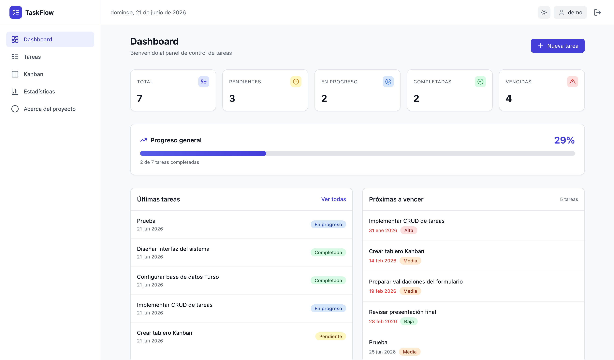
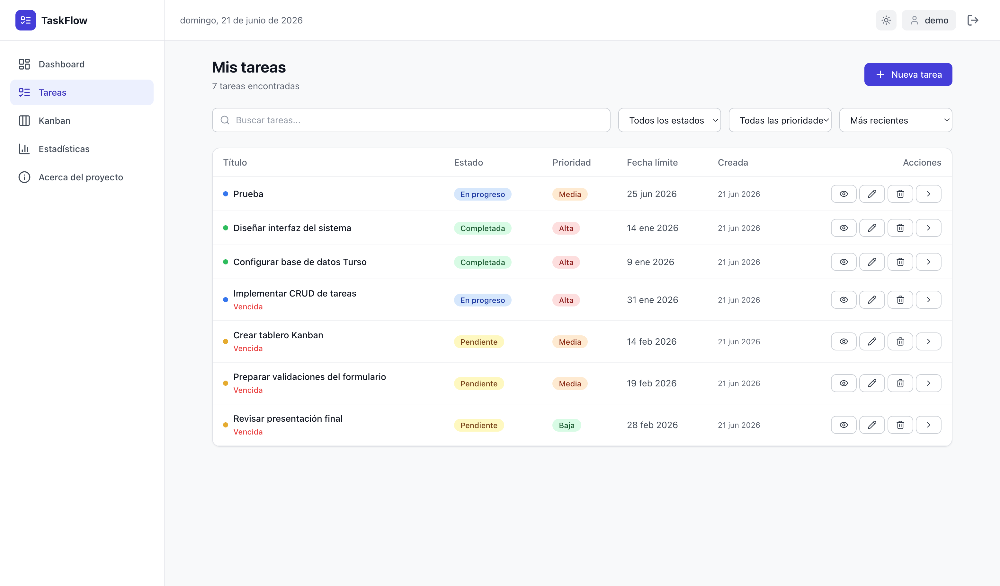
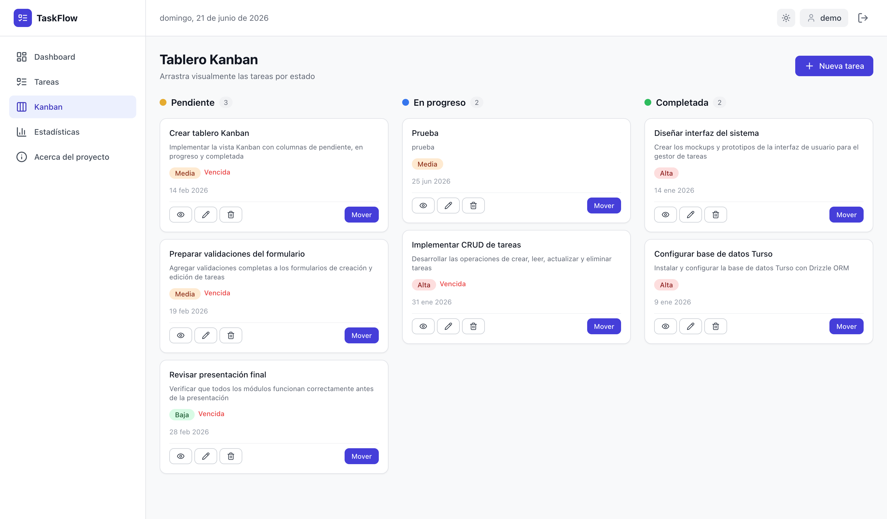
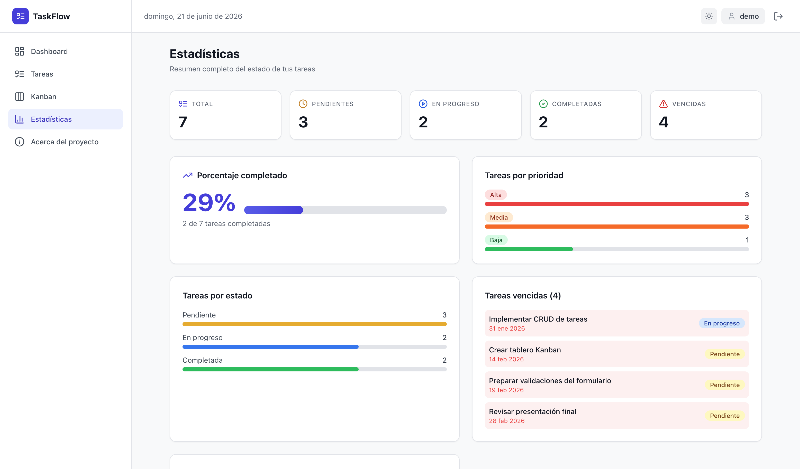

# TaskFlow — Gestión de Tareas

Aplicación web full-stack de gestión de tareas construida con **React + Hono + Turso**.

## Capturas de Pantalla

| Landing | Dashboard |
|---------|-----------|
|  |  |

| Tareas | Kanban |
|--------|--------|
|  |  |

| Estadísticas | Login | Registro |
|-------------|-------|----------|
|  |  |  |

## Tecnologías

| Tecnología | Propósito |
|------------|-----------|
| React 18 | Interfaz de usuario |
| TypeScript | Tipado estático |
| Vite | Build y dev server |
| Bun / Node.js | Runtime (compatible con ambos) |
| Hono | Backend API REST |
| Turso (libSQL) | Base de datos SQLite distribuida |
| Drizzle ORM | ORM tipado |
| Tailwind CSS | Estilos |
| Docker + Nginx | Contenedor multi-etapa + proxy reverso |
| GitHub Actions | Integración continua |

## Requisitos

- [Bun](https://bun.sh) (recomendado) o Node.js 18+
- Docker Desktop (para producción)

## Primeros Pasos

### 1. Clonar e Instalar

```bash
git clone https://github.com/Jcrow497111/trabajo_final_dev_ops.git
cd trabajo_final_dev_ops
bun install
```

> También funciona con `npm install`.

### 2. Configurar Variables de Entorno

El servidor necesita credenciales de Turso. Crea un archivo `.env` en la raíz:

```bash
TURSO_DATABASE_URL=libsql://<tu-database>.turso.io
TURSO_AUTH_TOKEN=eyJ...
```

El cliente en desarrollo necesita `client/.env`:

```bash
VITE_API_URL=http://localhost:3000
```

Y para build de producción `client/.env.production`:

```bash
VITE_API_URL=/api
```

> **Resumen:** El servidor lee `.env` (raíz). Vite lee `client/.env` (dev) o `client/.env.production` (build).

### 3. Migraciones

```bash
bun run db:migrate
```

### 4. Iniciar en Desarrollo

```bash
bun run dev
# o
npm run dev
```

| Servicio | URL |
|----------|-----|
| Frontend | http://localhost:5173 |
| Backend | http://localhost:3000/api/health |

## Scripts

| Comando | Descripción |
|---------|-------------|
| `bun run dev` | Frontend + backend en desarrollo |
| `bun run build` | Build de producción en `client/dist/` |
| `bun run start` | Solo servidor API (standalone) |
| `bun run typecheck` | Validar TypeScript |
| `bun run db:migrate` | Ejecutar migraciones |
| `bun run db:seed` | Datos de ejemplo |

## Validación

```bash
bun run typecheck
bun run build
```

## Producción (Docker)

```bash
export TURSO_DATABASE_URL=libsql://...
export TURSO_AUTH_TOKEN=eyJ...
docker compose up --build
```

Disponible en `http://localhost:8080`.

Dos servicios:
- **api** — Backend Hono con Bun (puerto 3000)
- **web** — Nginx con frontend estático + proxy `/api/` al backend

```
Navegador → http://localhost:8080
  ├── / → index.html (frontend)
  └── /api/* → proxy_pass → api:3000
```

Detener:

```bash
docker compose down
```

## Estructura

```
task-manager-devops-vv/
├── .github/workflows/     # Pipeline CI
├── client/                 # Frontend React (Vite)
│   └── src/
│       ├── components/     # Componentes UI
│       ├── pages/          # Páginas
│       ├── context/        # Auth, Theme, Toast
│       └── services/       # API client
├── server/                 # Backend Hono
│   ├── db/                 # Schema y migraciones
│   ├── routes/             # auth, tasks, stats
│   └── index.ts            # Entry point
├── shared/                 # Tipos y esquemas compartidos
├── infra/nginx/            # Configuración Nginx
├── screenshots/            # Capturas de pantalla
├── docs/                   # Documentación técnica
├── Dockerfile              # Build frontend
├── Dockerfile.api          # Build backend
├── docker-compose.yml      # Orquestación
└── package.json            # Dependencias y scripts
```

## CI/CD

GitHub Actions ejecuta en cada push:
1. `bun install --frozen-lockfile`
2. `bun run typecheck`
3. `cd client && bun run build`
4. Verifica artefacto en `client/dist/`
